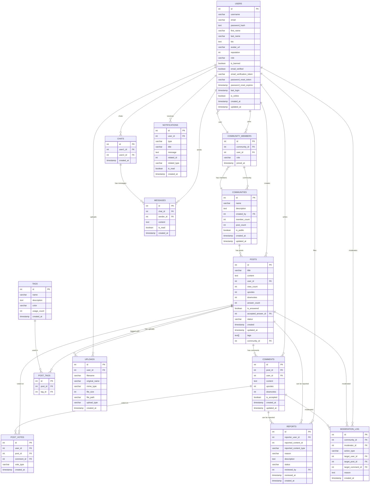

<!-- LOGO & TITLE -->
<p align="center">
  
</p>

<h1 align="center">StackIt — Singularity 🚀🤖</h1>
<p align="center">
  <b>The next-gen Q&A platform for communities, powered by humans & AI.</b>
</p>

<p align="center">
  
</p>

<p align="center">
  <a href="#"></a>
  <a href="#"></a>
  <a href="#"></a>
  <a href="#"></a>
  <a href="#"></a>
</p>

---

## ✨ Overview

StackIt is a **full-stack, community-driven Q&A platform** inspired by Stack Overflow and Reddit, but with a modern twist:
- **Communities** (subreddits) with join/leave, banners, and trending tags
- **Rich Questions & Answers** with images 🖼️, emojis 😎, and code blocks
- **Voting, Reputation, Leaderboards** — reward the best contributors!
- **Real-time Chat & Notifications** 🔔
- **Admin Dashboard** for moderation
- **Beautiful, responsive UI** with effects, animations, and dark mode

---

## 📚 Table of Contents

- [Features](#features)
- [Screenshots](#screenshots)
- [Tech Stack](#tech-stack)
- [Database Design](#database-design)
- [Getting Started](#getting-started)
- [API Overview](#api-overview)
- [Contributing](#contributing)
- [License](#license)
- [Contact](#contact)
- [Judging Criteria & Implementation](#judging-criteria--implementation)

---

## 🚀 Features

- 🏠 **Home Feed:** Trending questions, upvote/downvote, filter by tags
- 🏘️ **Communities:** Join, leave, create, and explore subreddits with custom banners
- 📝 **Ask & Answer:** Rich text editor with image upload, emoji picker, code formatting, and more
- 🏷️ **Tags:** Dynamic, trending, and filterable
- 💬 **Real-time Chat:** Connect with experts and peers instantly
- 🔔 **Notifications:** Stay updated on answers, mentions, and more
- 🏆 **Leaderboard:** See top contributors and your own stats
- 👤 **User Profiles:** Avatars, bios, activity, and messaging preferences
- 🛡️ **Admin Tools:** Moderate posts, users, and communities
- 🌈 **Modern UI:** Responsive, animated, and beautiful (with custom backgrounds and effects)
- 🔒 **Secure:** JWT auth, input sanitization, and more

---

## 🖼️ Screenshots


> _“Ask anything. Help anyone. Build the singularity.”_

---

## 🛠️ Tech Stack

| Frontend | Backend | Database | Realtime | Auth | Storage |
|----------|---------|----------|----------|------|---------|
|  <br> TypeScript <br> TailwindCSS <br> Vite |  |  |  | JWT | Cloudinary |

---

## 🗄️ Database Design

### Entity-Relationship Diagram



### Schema Overview

- **users**: Stores user accounts, roles, reputation, and profile info.
- **communities**: Subreddit-like groups with banners, privacy, and stats.
- **community_members**: Memberships and roles (member, moderator, admin) in communities.
- **posts**: Questions and discussions, linked to users and communities.
- **comments**: Answers and replies to posts.
- **tags**: Tag metadata (name, color, usage count).
- **post_tags**: Many-to-many relationship between posts and tags.
- **post_votes**: Upvotes/downvotes for posts and comments.
- **chats**: Private chat sessions between users.
- **messages**: Individual chat messages.
- **notifications**: System/user notifications (mentions, answers, etc).
- **reports**: User reports for moderation (questions, answers, users).
- **moderation_log**: Tracks moderation actions for transparency.
- **uploads**: File uploads (avatars, post images, etc).

---

## ⚡ Getting Started

### 1. Clone the repo

```sh
git clone https://github.com/yourusername/StackIt---Singularity.git
cd StackIt---Singularity
```

### 2. Install dependencies

```sh
cd client
npm install
cd ../server
npm install
```

### 3. Set up environment variables

- Copy `.env.example` to `.env` in both `client/` and `server/` and fill in your secrets (DB, JWT, Cloudinary, etc).

### 4. Run the app

**Backend:**
```sh
cd server
npm run dev
```

**Frontend:**
```sh
cd client
npm run dev
```

- Visit [http://localhost:8081](http://localhost:8081) (or your configured port)

---

## 🔌 API Overview

- **Auth:** `POST /users/login`, `POST /users/register`
- **Questions:** `GET /posts`, `POST /posts/create`, `POST /posts/:id/upvote`, `POST /posts/:id/downvote`
- **Answers:** `POST /posts/:id/comment`, `POST /posts/:postId/accept-answer/:commentId`
- **Communities:** `GET /api/communities`, `POST /api/communities/create`, `POST /api/communities/:slug/join`
- **Tags:** `GET /tags`
- **Uploads:** `POST /api/uploads/post-image`, `POST /api/uploads/avatar`
- **Notifications:** `GET /api/notifications`
- **Admin:** `GET /api/admin/users`, `GET /api/admin/posts`

> See [server/routes/](server/routes/) for all endpoints.

---

## 🎉 Effects & UI Magic

- ✨ **Animated backgrounds** and banners
- 🖼️ **Image upload** in posts and answers
- 😍 **Emoji picker** in the editor
- 🪄 **Smooth transitions** and hover effects
- 🌙 **Dark mode** (coming soon!)

---

## 🤝 Contributing

Contributions, issues, and feature requests are welcome!  
Please open an issue or PR, or just drop by and say hi!  
**Let’s build the future of Q&A together.**

---

## 📄 License

MIT © [Your Name]

---

## 👥 Team

StackIt — Singularity was built with passion and teamwork by:

- **Hitanshu Gala** — Backend development, database design, real-time features
- **Omkar Dalvi** — Backend development, API design, security
- **Mihir Patil** — Frontend development, UI/UX, React components
- **Pranav Dharvadkar** — Frontend development, UI/UX, state management

> Backend: Hitanshu & Omkar | Frontend: Mihir & Pranav

We collaborated closely across all features, with regular code reviews and shared design decisions to ensure a seamless full-stack experience.

---

## 📬 Contact

- **Project Lead:** [yourname@domain.com](mailto:yourname@domain.com)
- **GitHub:** [github.com/yourusername/StackIt---Singularity](https://github.com/yourusername/StackIt---Singularity)

---

## 🏆 Judging Criteria & Implementation

### Database Design (35%)
- **Schema Design:** The PostgreSQL schema is well-structured with clear relationships (see diagram above). All major entities (users, posts, communities, etc.) are normalized and use proper data types and constraints.
- **Real-time Sync:** Real-time chat and notifications are implemented using Socket.io (WebSockets). Posts, comments, and votes update instantly for all users.

### Coding Standards (40%)
- **Data Validation:** All user inputs are validated on both frontend (React forms) and backend (Express routes, middleware).
- **Dynamic Values:** No hardcoded values; all config (API URLs, secrets) are in environment variables. UI uses dynamic data from the backend.
- **Code Reusability:** Modular React components (e.g., forms, cards, modals) and backend utilities/middleware promote DRY code.
- **Performance:** Fast app load with code splitting, caching, and minimal network calls. Uses cookies and memory cache for sessions and user data.
- **Error Handling:** Comprehensive error handling on both frontend and backend, with user-friendly fallback messages.
- **Linting:** ESLint and Prettier are used to enforce code style and standards.
- **Complexity:** Efficient algorithms for search, filtering, and pagination. Minimal nested logic for maintainability.

### UI/UX Design (15%)
- **Responsive:** Fully responsive layout for mobile, tablet, and desktop.
- **Pagination & Breadcrumbs:** Implemented in lists and navigation for usability.
- **Search & Filter:** Powerful search and tag-based filtering in feeds and communities.
- **Color Scheme:** Carefully chosen color palette for readability and accessibility.

### Team Collaboration (10%)
- **Collaboration:** All team members contributed to both frontend and backend. Git history and PRs show active participation and code reviews.

---

<p align="center">
  <b>Made with ❤️, ☕, and way too many emojis.</b>
</p>
